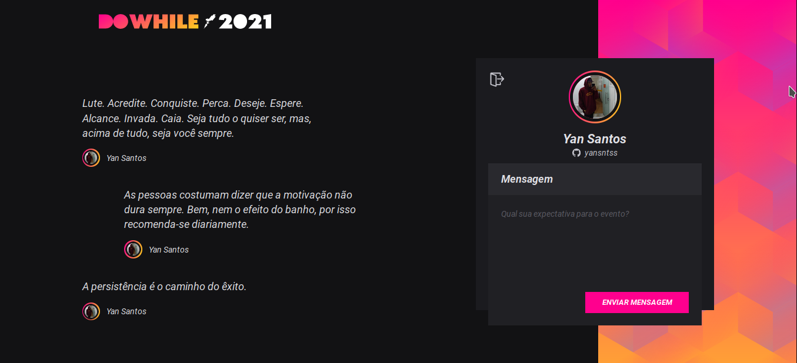

# NLW Heat Web




> Esse projeto foi desenvolvido durante a NLW Heat da Rocketseat. Ele tem como objetivo, armazenar comentarios de usuarios que vão participar do DoWilhe 2021. Essa é a versão  <strong> Web </strong> da aplicação.

## 💻 Pré-requisitos

Antes de começar, verifique se você atendeu aos seguintes requisitos:

* Versão mais recente do `Node.js + NPM`
* Clone no repositório  [NLW-heat-node](https://github.com/yansntss/NLW-heat-node).


## 🚀 Instalando NLW Heat Web

Para instalar o <strong>NLW Heat Web</strong>:

Clone o repositório e para instalar as dependencias, rode:
```
yarn
```

## ☕ Usando NLW Heat Web

Para usar o NLW Heat Web, rode esse comando para executar o server:

```
yarn dev
```
---

## 🚀  Tecnologias utilizada
- React
- scss
- Ts
- socket.io client
- vite


---
[Como instalar as ferramentas e bonus](https://efficient-sloth-d85.notion.site/Instala-o-das-ferramentas-b7c9f41e332a490d86fca81a5b830359).

---

## 📫 Contribuindo para NLW Heat Web
<!---Se o seu README for longo ou se você tiver algum processo ou etapas específicas que deseja que os contribuidores sigam, considere a criação de um arquivo CONTRIBUTING.md separado--->
Para contribuir com NLW Heat Web, siga estas etapas:

1. Bifurque este repositório.
2. Crie um branch: `git checkout -b <nome_branch>`.
3. Faça suas alterações e confirme-as: `git commit -m '<mensagem_commit>'`
4. Envie para o branch original: `git push origin <main> / <local>`
5. Crie a solicitação de pull.

Como alternativa, consulte a documentação do GitHub em [como criar uma solicitação pull](https://help.github.com/en/github/collaborating-with-issues-and-pull-requests/creating-a-pull-request).


